# coder-agent

Turn issues into working code. In your terminal.

[](https://github.com/Cha-Imaa/coder-agent/actions/workflows/ci.yml)
[](https://github.com/Cha-Imaa/coder-agent/actions/workflows/ci.yml)

[](https://cha-imaa.github.io/coder-agent/)

<p align="center">
  
</p>

<p align="center">
  <a href="https://cha-imaa.github.io/coder-agent/#watch-a-run">watch a run</a> ·
  <a href="https://cha-imaa.github.io/coder-agent/">docs</a> ·
  <a href="https://cha-imaa.github.io/coder-agent/results/">results</a> ·
  <a href="https://cha-imaa.github.io/coder-agent/try-it/">try it</a>
</p>

A terminal coding agent that takes a task in plain English, reads a target repository, plans a
change, edits files, runs the tests, and iterates on failures until they pass. Point it at an
issue URL and it opens the pull request.

Built to learn the agentic-AI stack end to end, on a zero-cost setup: every model call goes to a
free tier, every embedding is computed locally, and every file or shell action goes through a
sandbox jail.

| Concern | Technology |
|---|---|
| Agent orchestration | LangGraph state graph: plan, act, test, reflect |
| Tools | Two Model Context Protocol (MCP) servers: file and shell tools scoped to the repo, GitHub issues and pull requests |
| Codebase retrieval | tree-sitter chunking, local embeddings and Chroma, BM25 + dense with reciprocal rank fusion, optional cross-encoder reranker |
| Memory and control | SQLite checkpointer, `--resume`, human approval before writes and risky commands |
| Sandbox | Path jail, command denylist, timeouts, or a throwaway Docker container |
| LLM | Four providers behind one env var: Groq and K2 Think (hosted, free), Gemini as fallback, Ollama locally; retry with backoff, fallback chain |
| Observability | LangSmith tracing and a local SQLite ledger of tokens per node |
| Interface | Typer + Rich CLI: `coder run`, `coder chat`, `coder fix-issue`, `coder index`, `coder stats` |

## Quick start

```bash
git clone https://github.com/Cha-Imaa/coder-agent.git
cd coder-agent
uv sync --extra dev
cp .env.example .env   # fill in GROQ_API_KEY and GOOGLE_API_KEY (both free tiers)
```

```bash
uv run coder run path/to/repo "make the failing tests pass"          # one task, approve each edit
uv run coder chat path/to/repo                                        # several tasks on one thread
uv run coder fix-issue https://github.com/OWNER/REPO/issues/N --pr    # issue in, pull request out
uv run coder index path/to/repo --query "where are durations parsed"  # build and query the index
uv run coder stats                                                    # tokens and fallbacks per run
```

`coder run --help` lists the flags: `--yes` to skip approvals, `--sandbox docker`, `--resume`,
`--model provider:model`, `--max-iterations`, `--test-command`, `--tokens`.

## How it works

One run is one pass through a LangGraph state graph: `prepare` detects the test command,
`retrieve_context` pulls the relevant chunks, `plan` writes a short numbered plan, `act` reads and
edits through tool calls, `run_tests` decides, and `reflect` feeds the failing output back into
the next plan. The model never touches the filesystem itself: every read, edit and command is a
tool call served by an MCP server, and every one that writes or executes stops at the `approve`
node first unless `--yes` was given.


The MCP servers are separate processes talking JSON-RPC over stdio. The file server resolves every
path inside the repository and hands `run_command` to the sandbox — the local jail, or a fresh
Docker container with `--sandbox docker`; the graph sees the same tools either way.


Full walkthrough — what an agent is, why a state graph rather than a `while` loop, tools as a
protocol, sandboxing, retrieval: [`docs/system_design_coding_agent.md`](docs/system_design_coding_agent.md).

## Results

Twelve in-house tasks with hidden tests across five categories, plus a thirty-problem HumanEval
slice. Every number comes from a script in the repository and a results file under
`evals/results/`.

| Suite | Model | Passed | pass@1 | Mean tokens / task |
|---|---|---|---|---|
| In-house (12 tasks) | `groq:openai/gpt-oss-120b` | 12/12 | 100% | 29,663 |
| In-house (12 tasks) | `k2think:MBZUAI-IFM/K2-Think-v2` | 11/12 | 92% | 69,818 |
| HumanEval slice (30) | `k2think:MBZUAI-IFM/K2-Think-v2` | 30/30 | 100% | 13,174 |


The suite is small and the tasks are single-purpose, so 100% says the loop works, not that the
agent is done — a `--agent noop` run that touches nothing fails all twelve, so there are no free
passes. About 97% of the tokens go to the `act` node, and a four-arm ablation found **no
measurable difference between retrieval modes** on repositories this small.

The [results page](https://cha-imaa.github.io/coder-agent/results/) has the per-category tables,
the model comparison, the retrieval ablation and the failure analysis.

```bash
uv run python evals/run_evals.py     # all 12 tasks, ~356k tokens
uv run python evals/retrieval_eval.py # recall@k per retrieval mode
uv run pytest                         # the test suite, no API key needed
```

## Project layout

```
src/coder_agent/
  cli.py            Typer commands: run, chat, fix-issue, index, stats
  agent.py          builds the graph, MCP clients and checkpointer for one session
  graph/            state, nodes, routing, approval interrupt, context trimming
  mcp_server/       server.py (files + shell, jailed) and github.py (issues, PRs)
  sandbox/          local jail and Docker runner behind one interface
  rag/              loader, tree-sitter chunker, embeddings, Chroma index, hybrid retriever, reranker
  llm.py            provider factory, retry with backoff, fallback chain
  telemetry/        SQLite ledger of tokens, latency, iterations, outcome per run
evals/              the 12-task suite, the HumanEval slice, results and entry-point scripts
docs/               system design, results, the try-it walkthrough, figures, the player
tests/              pytest, no network and no API key needed
```
