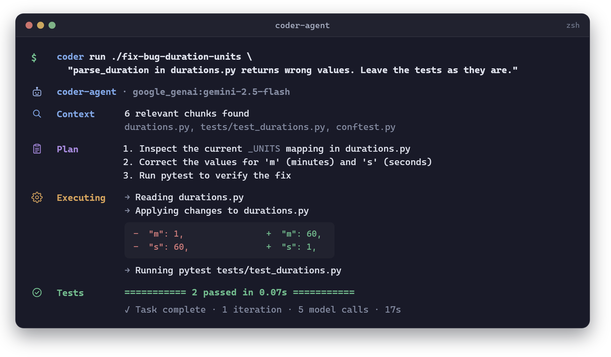
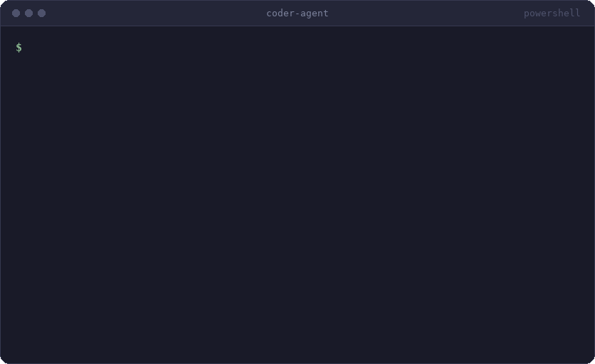
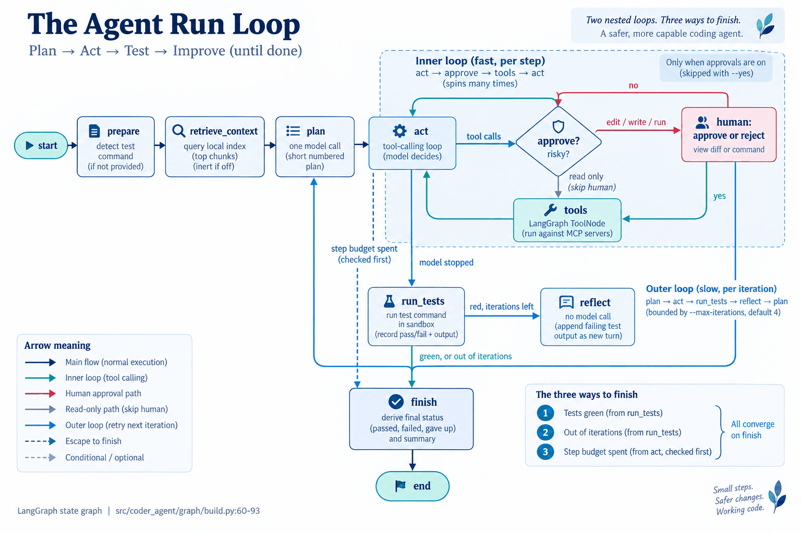
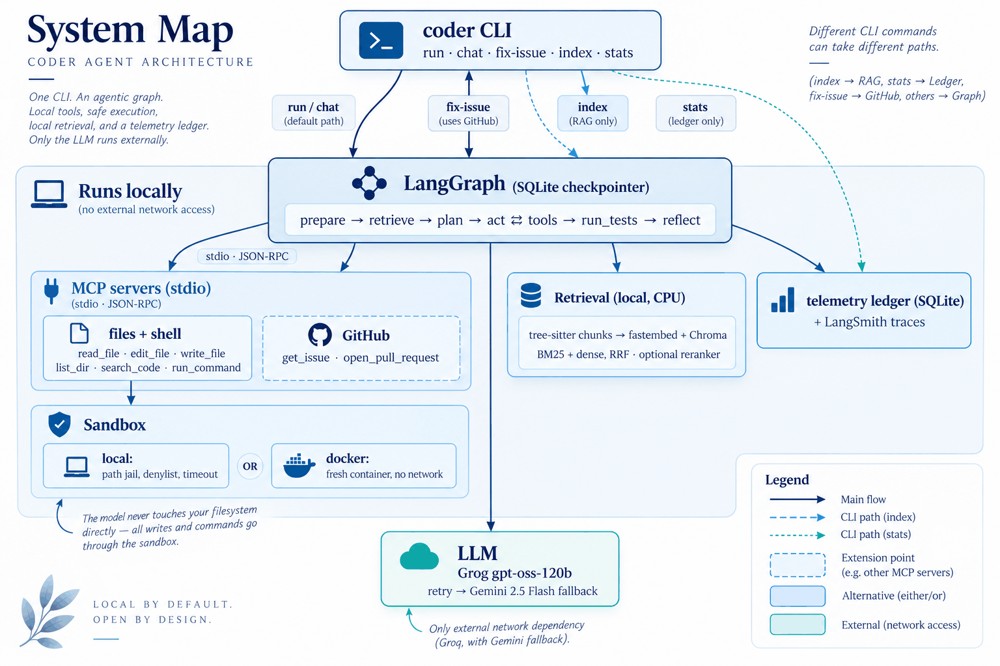

# coder-agent

Turn issues into working code. In your terminal.

[](https://github.com/Cha-Imaa/coder-agent/actions/workflows/ci.yml)
[](https://github.com/Cha-Imaa/coder-agent/actions/workflows/ci.yml)

[](https://cha-imaa.github.io/coder-agent/)

<p align="center">
  
</p>

A terminal coding agent that takes a task in plain English, reads a target repository, plans a
change, edits files, runs the tests, and iterates on failures until they pass. Point it at an
issue URL and it opens the pull request.

<details>
<summary>The same run as the terminal actually printed it: 28 rows, scrolling, with the approval prompt</summary>



</details>

Built to learn the agentic-AI stack end to end, on a zero-cost setup: every model call goes to a
free tier, every embedding is computed locally, and every file or shell action goes through a
sandbox jail.

| Concern | Technology |
|---|---|
| Agent orchestration | LangGraph state graph: plan, act, test, reflect |
| Tools | Two Model Context Protocol (MCP) servers: file and shell tools scoped to the repo, GitHub issues and pull requests |
| Codebase retrieval | tree-sitter chunking, local embeddings and Chroma, BM25 + dense with reciprocal rank fusion, optional cross-encoder reranker |
| Memory and control | SQLite checkpointer, `--resume`, human approval before writes and risky commands |
| Sandbox | Path jail, command denylist, timeouts, or a throwaway Docker container |
| LLM | Four providers behind one env var: Groq and K2 Think (hosted, free), Gemini as fallback, Ollama locally; retry with backoff, fallback chain |
| Observability | LangSmith tracing and a local SQLite ledger of tokens per node |
| Interface | Typer + Rich CLI: `coder run`, `coder chat`, `coder fix-issue`, `coder index`, `coder stats` |

The [docs site](https://cha-imaa.github.io/coder-agent/) has the learning log (one entry per
step: what was built, why, how production agents do it), the system design and the results.
[Try it](https://cha-imaa.github.io/coder-agent/try-it/) walks from an empty directory to the
agent opening a pull request.

## Quick start

```bash
git clone https://github.com/Cha-Imaa/coder-agent.git
cd coder-agent
uv sync --extra dev
cp .env.example .env   # fill in GROQ_API_KEY and GOOGLE_API_KEY (both free tiers)
```

```bash
uv run coder run path/to/repo "make the failing tests pass"          # one task, approve each edit
uv run coder chat path/to/repo                                        # several tasks on one thread
uv run coder fix-issue https://github.com/OWNER/REPO/issues/N --pr    # issue in, pull request out
uv run coder index path/to/repo --query "where are durations parsed"  # build and query the index
uv run coder stats                                                    # tokens and fallbacks per run
```

Flags worth knowing on `coder run`:

| Flag | What it does |
|---|---|
| `--yes` / `-y` | Skip the approval prompt before file edits and shell commands |
| `--sandbox docker` | Run the agent's commands in a fresh container, no network, repo mounted at `/work` |
| `--resume THREAD` | Continue a run that was interrupted by a crash, a rate limit or a declined approval |
| `--model provider:model` | Override `CODER_MODEL` for one run: `k2think:MBZUAI-IFM/K2-Think-v2`, `google_genai:gemini-2.5-flash`, or a local `ollama:qwen2.5-coder:7b` |
| `--max-iterations N` | Plan/act/test cycles before the agent gives up (default 4) |
| `--test-command "..."` | The command that decides success; auto-detected (pytest, npm test, ...) if omitted |

`fix-issue` clones the repository (or works in `--repo` your clone), runs the agent on a
`coder/issue-N` branch, and with `--pr` commits, pushes and opens the pull request once the tests
pass. Reading a public issue needs no token; `--pr` needs `GITHUB_TOKEN`.

## How it works

One run is one pass through a LangGraph state graph. The model never touches the filesystem
itself: every read, edit and command is a tool call served by an MCP server, and every tool call
that writes or executes stops at the `approve` node first unless `--yes` was given.



| Node | What it does |
|---|---|
| `prepare` | Detects the test command (pytest, npm test, ...) unless the caller supplied one |
| `retrieve_context` | Queries the local index with the task, puts the top chunks into the state as context (inert when retrieval is off) |
| `plan` | One model call: a short numbered plan from task, context and, after a red run, the test output |
| `act` | The tool-calling loop: the model reads, searches, edits and runs commands until it says it is done |
| `approve` | `interrupt()`s the run before `edit_file`, `write_file` or `run_command`; the terminal shows the diff or command and asks |
| `tools` | LangGraph's `ToolNode` executing the calls against the MCP servers, errors returned as tool output |
| `run_tests` | Runs the test command in the sandbox and records pass/fail plus the output |
| `reflect` | No model call: appends the failing test output as a new turn so the next plan starts from evidence |
| `finish` | Derives the final status (passed, failed, gave up) and summary; the caller then writes tokens per node, latency and outcome to the SQLite ledger |

Around the graph:



The MCP servers are separate processes talking JSON-RPC over stdio. The file server resolves
every path inside the repository and hands `run_command` to the sandbox, which is either the
local jail (denylist, timeout) or a fresh Docker container with `--sandbox docker`; the graph
sees the same tools either way. The GitHub server is the same shape as any third-party MCP
server the agent could be pointed at. The concept walkthrough is in
[`docs/system_design_coding_agent.md`](docs/system_design_coding_agent.md).

## Results

Every number comes from a script in the repository and a results file under `evals/results/`;
`evals/figures.py` redraws the charts from those files. The full write-up, including the
retrieval-mode and reranker tables, is on the
[results page](https://cha-imaa.github.io/coder-agent/results/).

### In-house suite

Twelve tasks with hidden tests across five categories, run with `groq:openai/gpt-oss-120b`, up
to four plan/act/test iterations, retrieval on. Every task was solved in one cycle. Six tasks
first errored on the free-tier quota (Groq allows 200k tokens per rolling 24 hours) and were
rerun with `--rerun-errors`; the results file records both commits.

| Category | Tasks | Passed | Errors | pass@1 | Avg tokens | Avg iterations |
|---|---|---|---|---|---|---|
| fix-bug | 3 | 3 | 0 | 100% | 12,443 | 1.0 |
| add-feature | 3 | 3 | 0 | 100% | 28,984 | 1.0 |
| refactor | 2 | 2 | 0 | 100% | 25,451 | 1.0 |
| add-test | 2 | 2 | 0 | 100% | 19,222 | 1.0 |
| multi-file | 2 | 2 | 0 | 100% | 71,164 | 1.0 |
| total | 12 | 12 | 0 | 100% | 29,663 | 1.0 |


The suite is small and the tasks are single-purpose, so 100% says the loop works, not that the
agent is done. A `--agent noop` run that touches nothing fails all twelve, so there are no free
passes in the suite.


### Where the tokens go

About 97% of the tokens per run are spent in the `act` node reading files and running tools,
around 29k against under 1k for `plan`. That is the number codebase retrieval is meant to move.


### Retrieval quality

`evals/retrieval_eval.py` uses each task prompt as the query and scores the files in hit order
against the gold files of the task, over 40 tasks (ten in-house, thirty HumanEval).

| mode | recall@1 | recall@3 | recall@5 | MRR |
|---|---|---|---|---|
| hybrid | 0.08 | 0.99 | 1.00 | 0.56 |
| hybrid + rerank | 0.50 | 0.99 | 1.00 | 0.76 |

The benchmark repositories have three to five files, so file-level recall saturates at k=3 and
the first-stage modes (bm25, dense, hybrid) are indistinguishable on this corpus. Without
reranking the first hit is almost always the visible test file; the cross-encoder moves the
source module to rank one in half of the cases. It stays off by default: about 1.5 seconds per
query for a change in ordering, not in which chunks are present.

### Model comparison

The same twelve tasks, the same graph and retrieval, a second model. Both runs are single
passes; K2 Think ran three tasks at a time (`--parallel 3`).

| model | passed | pass@1 | mean tokens / task | mean seconds / task | steps / task |
|---|---|---|---|---|---|
| `groq:openai/gpt-oss-120b` | 12/12 | 100% | 29,663 | 174 | 10.8 |
| `k2think:MBZUAI-IFM/K2-Think-v2` | 11/12 | 92% | 69,818 | 111 | 15.2 |


K2 Think is faster per task and spends more than twice the tokens getting there: it takes more
tool-calling steps, and each step resends the conversation. Its one failure is a multi-file
task where it hit the forty-step cap with the edits half done. Groq's gpt-oss-120b solved the
same task in 25 steps.

### Retrieval ablation

Four runs of the twelve-task suite on K2 Think, one per retrieval mode, all in one afternoon.
`off` sends the planner no retrieved context at all.

| mode | passed | pass@1 | mean tokens / task | median | mean steps | mean seconds |
|---|---|---|---|---|---|---|
| off | 12/12 | 100% | 60,534 | 40.0k | 14.9 | 72 |
| bm25 | 9/12 | 75% | 66,654 | 31.9k | 12.4 | 90 |
| dense | 10/12 | 83% | 69,958 | 33.6k | 15.2 | 111 |
| hybrid (default) | 11/12 | 92% | 69,818 | 40.0k | 15.2 | 111 |


**The honest reading is that retrieval mode makes no measurable difference on this suite.**
The pass rates sit within three tasks of each other on twelve, and the token means within 15%,
while the same task varies far more between arms than the arms do between themselves: one
task cost 20k tokens in three arms and 160k in the fourth, another 67k to 256k. With one run
per arm that spread is the noise floor, and every difference in the table is under it. The
retrieval eval above predicted this: the benchmark repositories have three to five files,
recall@3 is 0.99 for every mode, and the planner is shown the right file whichever way it
is found. Retrieval is built for repositories where finding the file is the problem; on ones
this small the model finds it in one `list_dir`.

The six failures across the arms have two shapes: two runs that hit the forty-step cap with
the edits half done (256k and 392k tokens), and four fixes that passed the visible tests and
failed a hidden one, each after one iteration and under twelve steps. The second shape is the
one the harness exists to catch: the agent's own verdict was "passed" every time.

### HumanEval slice

Thirty HumanEval problems packaged as repository tasks (a stub module, a visible smoke test,
the official tests hidden), run on K2 Think.

| Tasks | Passed | pass@1 | mean tokens / task | mean steps | mean seconds |
|---|---|---|---|---|---|
| 30 | 30 | 100% | 13,174 | 5.4 | 57 |

These are single-function problems that current hosted models solve on their own, so the
number says the harness does not get in the model's way; the in-house suite, with its
multi-file tasks and hidden tests that differ from the visible ones, is where the agent is
actually measured.

### Reproduce

```bash
uv run python evals/run_evals.py                          # all 12 tasks, ~356k tokens
uv run python evals/run_evals.py --quick                  # 4-task subset, ~57k, not a headline number
uv run python evals/run_evals.py --parallel 4 --model k2think:MBZUAI-IFM/K2-Think-v2   # minutes, not a day
uv run python evals/run_evals.py --suite humaneval        # 30 HumanEval problems as repo tasks
uv run python evals/run_evals.py --retrieval off          # one ablation arm
uv run python evals/retrieval_eval.py                     # recall@k per retrieval mode
uv run python evals/figures.py                            # redraw docs/figures/*.png
uv run pytest                                             # the test suite, no API key needed
```

## Project layout

```
src/coder_agent/
  cli.py            Typer commands: run, chat, fix-issue, index, stats
  agent.py          builds the graph, MCP clients and checkpointer for one session
  graph/            state, nodes, routing, approval interrupt, context trimming
  mcp_server/       server.py (files + shell, jailed) and github.py (issues, PRs)
  sandbox/          local jail and Docker runner behind one interface
  rag/              loader, tree-sitter chunker, embeddings, Chroma index, hybrid retriever, reranker
  llm.py            provider factory, retry with backoff, fallback chain
  k2think.py        the transport that keeps K2 Think's firewall from refusing the agent's own history
  telemetry/        SQLite ledger of tokens, latency, iterations, outcome per run
  evals/            task suites, isolated runner, retrieval eval, figures
evals/              the 12-task suite, the HumanEval slice, results and entry-point scripts
scripts/            demo recorder and GIF renderer (demo.py, record_demo.ps1)
docs/               learning log (TEACH.md), roadmap (PLAN.md), system design, results, figures
tests/              pytest, no network and no API key needed
```

## Learning log and roadmap

- [`docs/TEACH.md`](docs/TEACH.md): one entry per finished step, written for someone learning the
  stack. Each entry says what was built, why that way, how production coding agents do the same
  thing, and gives a command to check it.
- [`docs/PLAN.md`](docs/PLAN.md): the weighted roadmap; checked boxes are finished steps.
- [`docs/system_design_coding_agent.md`](docs/system_design_coding_agent.md): the concept-first
  walkthrough of agents, LangGraph, MCP, sandboxing, retrieval and evaluation.

## Contributing and licence

Issues and pull requests are welcome; [`CONTRIBUTING.md`](CONTRIBUTING.md) has the setup, the
checks CI runs and the commit conventions, and [`CHANGELOG.md`](CHANGELOG.md) tracks what a user
would notice. MIT licence, see [`LICENSE`](LICENSE).
