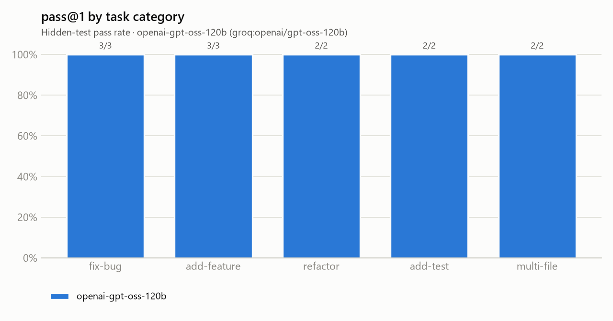
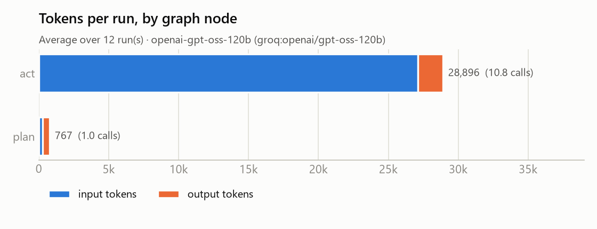

# coder-agent

A terminal coding agent that takes a task in plain English, reads a target repository, plans a change,
edits files, runs the tests, and iterates on failures until they pass.

Built to learn the agentic-AI stack end to end, on a zero-cost setup:

| Concern | Technology |
|---|---|
| Agent orchestration | LangGraph state graph (plan → act → test → reflect) |
| Tools | Model Context Protocol (MCP) server exposing file and shell tools |
| Codebase retrieval | Local embeddings (bge-small) + Chroma vector store |
| LLM | Groq free tier, Gemini free tier as fallback, swappable via one env var |
| Observability | LangSmith tracing |
| Interface | Typer + Rich CLI |

## Status

Work in progress. See the commit history for the step-by-step build.

### First numbers

In-house suite of 12 tasks with hidden tests, `groq:openai/gpt-oss-120b`, up to 4 iterations.
Every task was solved in one plan/act/test cycle. Six tasks first errored on the free-tier daily
quota (Groq 200k tokens/day) and were rerun the next day with `--rerun-errors`; the results file
records both commits.

| Category | Tasks | Passed | Errors | pass@1 | Avg tokens | Avg iterations |
|---|---|---|---|---|---|---|
| fix-bug | 3 | 3 | 0 | 100% | 12,443 | 1.0 |
| add-feature | 3 | 3 | 0 | 100% | 28,984 | 1.0 |
| refactor | 2 | 2 | 0 | 100% | 25,451 | 1.0 |
| add-test | 2 | 2 | 0 | 100% | 19,222 | 1.0 |
| multi-file | 2 | 2 | 0 | 100% | 71,164 | 1.0 |
| total | 12 | 12 | 0 | 100% | 29,663 | 1.0 |



Where the tokens go: almost all of the budget is spent in the `act` node reading files and
running tools, which is what codebase retrieval (milestone 5) is meant to cut.



Reproduce with `uv run python evals/run_evals.py`; raw results are in `evals/results/` and
`uv run python evals/figures.py` redraws every chart from them. The 12-task suite is small and
the tasks are single-purpose, so 100% says the loop works, not that the agent is done: the
HumanEval slice below and the retrieval ablation are the harder numbers.

A second suite packages the first 30 [HumanEval](https://github.com/openai/human-eval) problems
as repository tasks (stub module, docstring examples as the visible doctest, the original
`check` as the hidden test): `uv run python evals/run_evals.py --suite humaneval`. Numbers for it
follow once the daily quota allows a full run.

## Setup

```bash
uv sync --extra dev
cp .env.example .env   # fill in your keys
```
