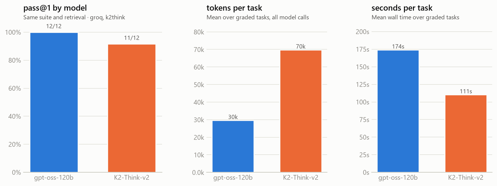
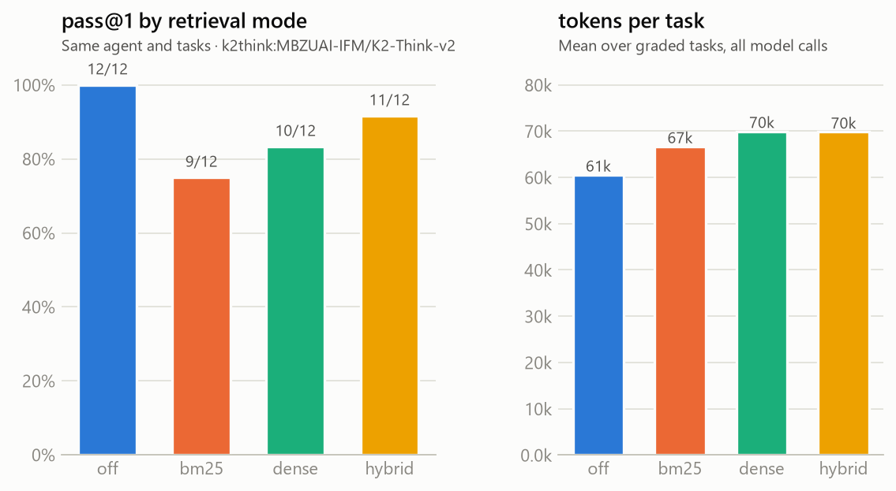

# Results

Every number here comes from a script in the repository and a results file under
`evals/results/`, so it can be regenerated after any change. The figures are drawn by
`evals/figures.py` from those files.

## Pass rate on the in-house suite

Twelve tasks with hidden tests across five categories, run with `groq:openai/gpt-oss-120b`, up to
four plan/act/test iterations, retrieval on. Every task was solved in one cycle. Six tasks first
errored on the free-tier quota (Groq allows 200k tokens per rolling 24 hours) and were rerun with
`--rerun-errors`; the results file records both commits.

| Category | Tasks | Passed | Errors | pass@1 | Avg tokens | Avg iterations |
|---|---|---|---|---|---|---|
| fix-bug | 3 | 3 | 0 | 100% | 12,443 | 1.0 |
| add-feature | 3 | 3 | 0 | 100% | 28,984 | 1.0 |
| refactor | 2 | 2 | 0 | 100% | 25,451 | 1.0 |
| add-test | 2 | 2 | 0 | 100% | 19,222 | 1.0 |
| multi-file | 2 | 2 | 0 | 100% | 71,164 | 1.0 |
| total | 12 | 12 | 0 | 100% | 29,663 | 1.0 |

The suite is small and the tasks are single-purpose, so 100% says the loop works, not that the
agent is done. A `--agent noop` run that touches nothing fails all twelve, so there are no free
passes in the suite.

## Where the tokens go

Almost the whole budget is spent in the `act` node reading files and running tools: about 97% of
tokens per run, around 29k against under 1k for `plan`. That is the number codebase retrieval is
meant to move.

## Retrieval quality

`evals/retrieval_eval.py` uses each task prompt as the query and scores the distinct files in hit
order against the gold files of the task. 40 tasks (ten in-house, thirty HumanEval), local
embeddings (`snowflake-arctic-embed-xs`), reranker `Xenova/ms-marco-MiniLM-L-6-v2` over twenty
candidates.

| mode | recall@1 | recall@3 | recall@5 | MRR |
|---|---|---|---|---|
| hybrid | 0.08 | 0.99 | 1.00 | 0.56 |
| dense | 0.08 | 0.99 | 1.00 | 0.56 |
| bm25 | 0.08 | 0.99 | 1.00 | 0.55 |
| hybrid + rerank | 0.50 | 0.99 | 1.00 | 0.76 |
| dense + rerank | 0.50 | 0.99 | 1.00 | 0.76 |
| bm25 + rerank | 0.50 | 0.99 | 1.00 | 0.76 |

Two things to read out of this table. First, the benchmark repositories have three to five files,
so file-level recall saturates at k=3 and the three first-stage modes cannot be told apart on this
corpus. Second, without reranking the file ranked first is almost always the visible test file,
because the prompt describes behaviour and the test spells it out in the same words; the
cross-encoder moves the source module to rank one in half of those cases and lifts MRR from 0.56
to 0.76. The reranker stays off by default: it costs about 1.5 seconds per query and changes which
chunk is first, not which chunks are present, in a context block that already holds six.

## Provider fallback

The ledger records which model answered each call. Before the retry layer was added, the Gemini
fallback answered at least one call in 12 of 17 runs, and 25 of 191 calls overall (13%) went to
Gemini, most of them a single Groq `tool_use_failed` glitch handed straight to the fallback.
`coder stats` prints the current numbers.

## Model comparison

The same twelve tasks, the same graph and retrieval, a second model. Both runs are single
passes; K2 Think ran three tasks at a time (`run_evals.py --parallel 3`), which its rate limit
allows once the pool narrows itself from three workers to two.

| model | passed | pass@1 | mean tokens / task | mean seconds / task | steps / task |
|---|---|---|---|---|---|
| `groq:openai/gpt-oss-120b` | 12/12 | 100% | 29,663 | 174 | 10.8 |
| `k2think:MBZUAI-IFM/K2-Think-v2` | 11/12 | 92% | 69,818 | 111 | 15.2 |

K2 Think is a reasoning model: it is faster per task, because K2's endpoint has no per-minute
token cap to wait on, and spends more than twice the tokens, because it takes more tool-calling
steps (15 against 11) and each step resends the conversation. Its output share is small, about
6k of 70k, so the cost is the number of round trips, not the thinking. Its one failure is
`multi-file-notes-delete`, where it hit the forty-step cap with the edits half done; gpt-oss-120b
solved the same task in 25 steps.

A local 7B model through Ollama (`--model ollama:qwen2.5-coder:7b`) is wired but not in the
figure: a first run is a useful warning about what a 7B on a laptop CPU is. `fix-bug-duration-units`
failed after 8 model calls, 15.5k tokens and 744 seconds, because the model narrates the edit in
markdown and claims success instead of calling the tools (see step 7.2 in TEACH).

## Retrieval ablation

Four runs of the twelve-task suite on K2 Think, one per retrieval mode, all at commit `ab4b597`
in one afternoon. `off` sends the planner no retrieved context at all; `bm25` and `dense` are
the two halves of the default `hybrid`.

| mode | passed | pass@1 | mean tokens / task | median | mean steps | mean seconds |
|---|---|---|---|---|---|---|
| off | 12/12 | 100% | 60,534 | 40.0k | 14.9 | 72 |
| bm25 | 9/12 | 75% | 66,654 | 31.9k | 12.4 | 90 |
| dense | 10/12 | 83% | 69,958 | 33.6k | 15.2 | 111 |
| hybrid (default) | 11/12 | 92% | 69,818 | 40.0k | 15.2 | 111 |

**Retrieval mode makes no measurable difference on this suite.** Three readings support that:

- The pass rates sit within three tasks of each other on twelve, and the token means within
  15%. The order (off best, bm25 worst) is not the one any theory predicts, which is what a
  null result looks like when the arms are ranked by noise.
- The same task varies far more between arms than the arms do between themselves.
  `add-test-mathx` cost 20k tokens in three arms and 160k in the fourth; `multi-file-notes-delete`
  ranged from 67k to 256k; `add-feature-slugify` from 33k to 392k. With one run per arm that
  spread is the noise floor, and every difference between arms is under it.
- The retrieval eval predicted it. The benchmark repositories have three to five files,
  recall@3 is 0.99 for every mode, and the planner is shown the right file whichever way it
  is found. Retrieval is built for repositories where finding the file is the problem; on
  ones this small the model finds it in one `list_dir`.

An earlier partial `off` arm on Groq (eight tasks, a different commit) had suggested 23% more
tokens without retrieval. Twelve tasks on one model at one commit do not reproduce it, and the
earlier number is withdrawn: it was inside the same noise.

### What failed, and how

Six failures across 48 task runs, in two shapes:

| shape | failures | what happened |
|---|---|---|
| hit the 40-step cap | 2 | `multi-file-notes-delete` (hybrid, 256k tokens), `add-feature-slugify` (bm25, 392k over two iterations). A third run, `multi-file-cart-discount` (dense), also hit the cap but with the edits complete, and the hidden tests passed |
| passed its own tests, failed a hidden one | 4 | `fix-bug-shared-default-list` twice (bm25, dense), `multi-file-notes-delete` (bm25), `add-test-mathx` (dense) |

The first shape is a budget question: a multi-file task on K2 takes 30 to 40 tool calls and
`CODER_MAX_STEPS=40` sits right at that edge. The second is the reason the suite has hidden
tests. In all four of those runs the agent's own verdict was "passed", after one iteration and
fewer than twelve steps: it made the visible tests green and stopped, and the hidden test it
never saw (the callers' list must not be mutated; two explicit lists must stay separate; the
new test must catch a `gcd` sign mutant) is what the task was actually about.

## HumanEval slice

Thirty HumanEval problems packaged as repository tasks (a stub module, a visible smoke test, the
official tests hidden), run on K2 Think three at a time.

| Tasks | Passed | pass@1 | mean tokens / task | median | mean steps | mean seconds |
|---|---|---|---|---|---|---|
| 30 | 30 | 100% | 13,174 | 12.2k | 5.4 | 57 |

Every problem was solved in one plan/act/test cycle and about five tool calls: read the stub,
write the function, run the tests, finish. These are single-function problems that current hosted models solve on their own, so the
number says the harness does not get in the model's way; the in-house suite, with its multi-file tasks and hidden tests that differ from the visible
ones, is where the agent is actually measured.
